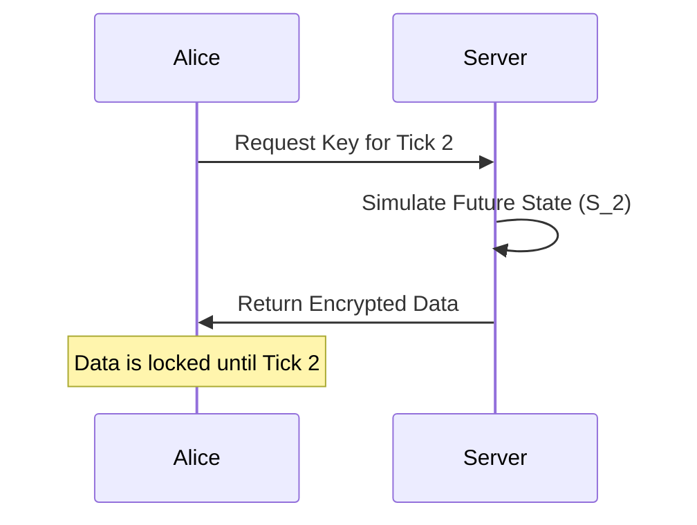
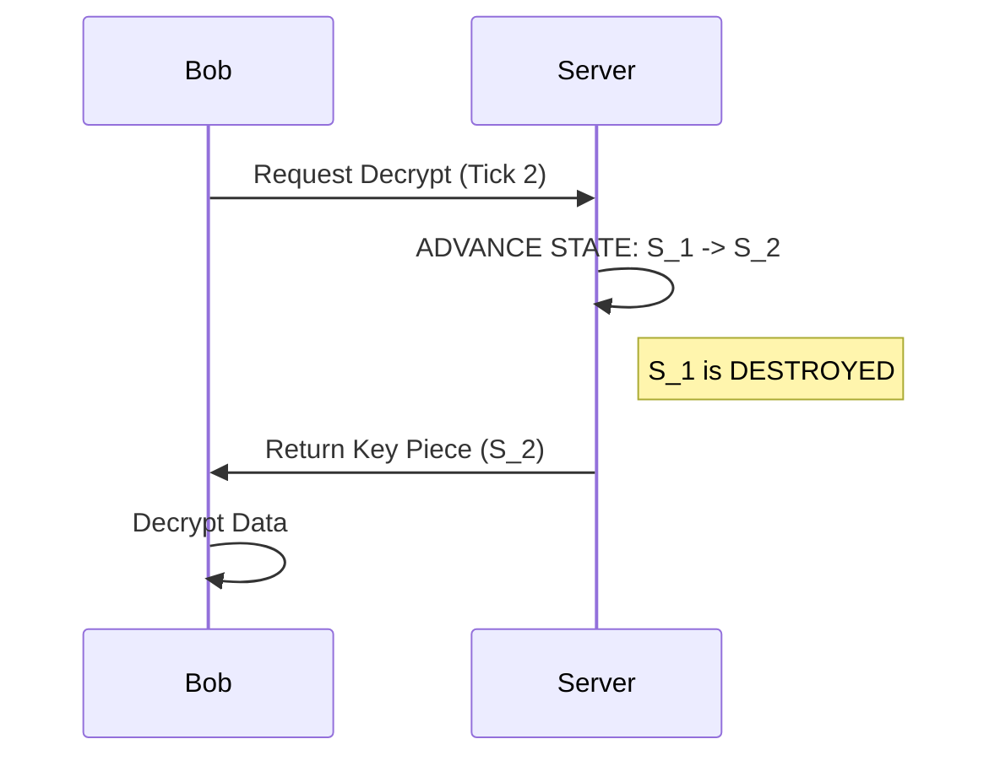
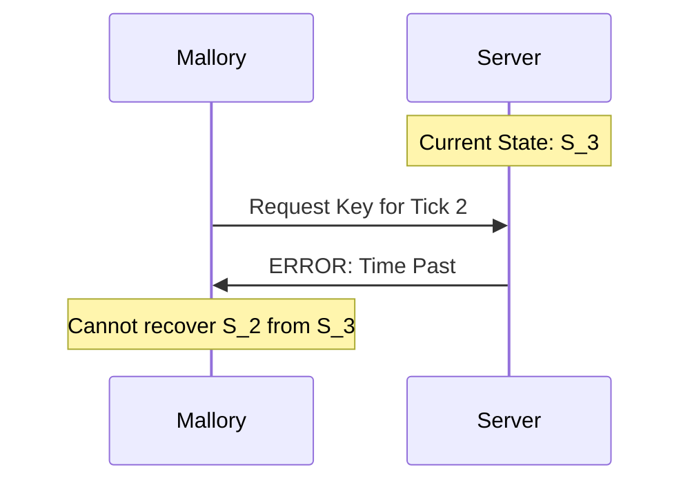

# Time-Evolving Ephemeral Encryption: A Step-by-Step Technical Walkthrough

## 1. Introduction
This document provides a detailed, granular breakdown of the Time-Evolving Ephemeral Encryption Protocol. To make the cryptography transparent, we will use a **"Toy Model"** with simple numbers instead of complex 256-bit hashes. This allows us to trace the exact lifecycle of a secret key from creation to destruction.

### The Core Concept
The protocol relies on a **One-Way Function** (a hash).
*   **Real World:** SHA-256.
*   **Toy Model:** We will use a simple function: `H(x) = (x + 1) modulo 10`.
    *   *Example:* If input is 5, output is 6. If input is 9, output is 0.
    *   *One-Way Property:* If I tell you the result is 6, you know the input was 5. (In this toy model, it's reversible, but imagine for a moment it isn't, like SHA-256).

---

## 2. The Cast of Characters
*   **The Server (The Timekeeper):** Holds the secret state. It moves forward in time but never backward.
*   **Alice (The Sender):** Wants to send a message to the future.
*   **Bob (The Receiver):** Wants to read the message at the correct time.
*   **Mallory (The Attacker):** Wants to read the message after the time has passed.

---

## 3. Step-by-Step Walkthrough

### Step 1: Genesis (Time $t=0$)
The Server initializes itself. It generates two random starting numbers: a **Public Seed ($X_0$)** and a **Private State ($S_0$)**.

*   **Public Seed ($X_0$):** `5` (Visible to everyone)
*   **Private State ($S_0$):** `3` (Kept secret in Server RAM)

**Status:**
*   Server Memory: `{ S: 3, t: 0 }`
*   Public Knowledge: `{ X: 5 }`

---

### Step 2: Encryption (Alice Locks the Data)
**Scenario:** It is currently **Tick 0**. Alice wants to encrypt a file so it can be read at **Tick 2**.

1.  **Alice's Request:** "I need the encryption key for Tick 2."
2.  **Public Chain Computation:** Alice (or the Server) computes the public timeline to Tick 2.
    *   $X_1 = H(X_0) = (5+1) = 6$
    *   $X_2 = H(X_1) = (6+1) = 7$
    *   **Public Key Piece ($K_{pub}$):** `7`
3.  **Private Simulation:** The Server is at $S_0=3$. It needs to know what the secret *will be* at Tick 2, without actually moving there yet. It simulates the evolution:
    *   Future $S_1 = H(S_0 + X_0) = (3+5) = 8$
    *   Future $S_2 = H(S_1 + X_1) = (8+6) = 4$ (Note: using simplified addition for clarity)
    *   **Private Key Piece ($K_{priv}$):** `4`
4.  **Key Combination:** The final encryption key is the sum of the pieces.
    *   $K_{final} = K_{pub} + K_{priv} = 7 + 4 = 11$
5.  **Encryption:** Alice encrypts her file with Key `11`. She saves the file `secret.enc`.

**Status:**
*   Server Memory: `{ S: 3, t: 0 }` (Unchanged)
*   Alice has `secret.enc` (Locked with Key 11).

---

### Step 3: The Passage of Time (Tick 0 $\to$ Tick 1)
The Server's clock ticks forward. This is a **destructive** operation.

1.  **Evolution:** Server computes the next state.
    *   $S_1 = H(S_0 + X_0) = (3+5) = 8$
2.  **The Overwrite:** The Server **deletes** $S_0$ (`3`) from memory and replaces it with $S_1$ (`8`).

**Status:**
*   Server Memory: `{ S: 8, t: 1 }`
*   **Crucial Note:** The value `3` (the root of the previous key) is now gone from the universe.

---

### Step 4: Decryption (Bob Unlocks the Data)
**Scenario:** It is now **Tick 1**. Bob wants to decrypt the file (target Tick 2). He must wait one more tick, or trigger the server to advance. Let's say he triggers the advance to **Tick 2**.

1.  **Bob's Proof:** Bob shows the Server the Public Chain up to Tick 2 ($X_2=7$).
2.  **Server Verification:** "Yes, $X_2$ is indeed 7."
3.  **The Advance (The Burn):** The Server is at $S_1=8$. It must move to $S_2$ to generate the key.
    *   Server computes $S_2 = H(S_1 + X_1) = (8+6) = 4$.
    *   Server **overwrites** $S_1$ (`8`) with $S_2$ (`4`).
4.  **Key Release:** Server sends Bob the Private Key Piece ($K_{priv} = 4$).
5.  **Decryption:** Bob combines it with his Public Piece ($K_{pub} = 7$).
    *   $K_{final} = 7 + 4 = 11$.
    *   Bob decrypts `secret.enc` with Key `11`. **Success!**

**Status:**
*   Server Memory: `{ S: 4, t: 2 }`
*   The value `8` (State at Tick 1) is gone.

---

### Step 5: The Attack (Tick 3 - Too Late)
**Scenario:** It is now **Tick 3**. Mallory steals `secret.enc` from Bob's laptop. She sees it was encrypted for **Tick 2**. She goes to the Server.

1.  **Mallory's Request:** "Give me the key for Tick 2."
2.  **Server Check:**
    *   Current Time: **Tick 3**
    *   Requested Time: **Tick 2**
3.  **The Impossibility:** The Server holds $S_3$. To give Mallory the key for Tick 2, it would need $S_2$.
    *   To get from $S_3$ back to $S_2$, the Server would need to **reverse** the hash function.
    *   $S_3 = H(S_2 + ...)$
    *   In cryptography, you cannot reverse $H(x)$. You cannot turn an omelet back into an egg.
4.  **Rejection:** The Server replies: "I cannot help you. That time has passed. The state $S_2$ has been overwritten."

**Result:**
The key `11` no longer exists anywhere. The file `secret.enc` is mathematically indistinguishable from random noise. Mallory has nothing.

---

## 4. Visual Sequence Diagrams

### Encryption (Alice)

### Decryption (Bob)

### Failure (Mallory)

